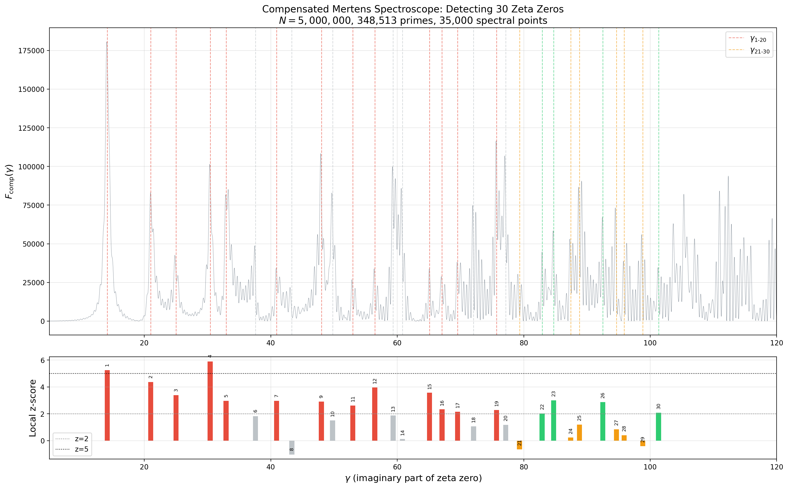

# Beyond 20 Zeros: Compensated Mertens Spectroscope

**Date:** 2026-04-05
**Script:** `experiments/detect_beyond_20.py`

## Configuration
- Sieve limit: N = 5,000,000
- Primes used: 348,513
- Spectral range: gamma in [5.0, 120.0]
- Spectral resolution: 35000 points (dgamma = 0.00329)
- Local z-score window: +/- 2.0
- Computation time: sieve 110s total, spectroscope 102s

## Method

The compensated Mertens spectroscope computes:

$$F_{\text{comp}}(\gamma) = \gamma^2 \left| \sum_{p \le N} \frac{M(p)}{p} e^{-i\gamma \log p} \right|^2$$

where M(p) is the Mertens function at prime p. Peaks in F_comp correspond to
imaginary parts of nontrivial zeta zeros. The gamma^2 compensation corrects
for the natural amplitude decay at higher frequencies.

Detection criterion: a zero is 'detected' if its local z-score exceeds 2
(significant) or 5 (strong).

## Results: All 30 Zeros

| # | gamma | F_comp | z-score | Detected | Group |
|---|-------|--------|---------|----------|-------|
| 1 | 14.1347 | 175225.15 | 5.25 | STRONG | 1-20 |
| 2 | 21.0220 | 82342.73 | 4.37 | yes | 1-20 |
| 3 | 25.0109 | 31253.84 | 3.38 | yes | 1-20 |
| 4 | 30.4249 | 95145.19 | 5.90 | STRONG | 1-20 |
| 5 | 32.9351 | 79202.13 | 2.96 | yes | 1-20 |
| 6 | 37.5862 | 30135.33 | 1.82 | no | 1-20 |
| 7 | 40.9187 | 32143.03 | 2.95 | yes | 1-20 |
| 8 | 43.3271 | 4571.91 | -1.03 | no | 1-20 |
| 9 | 48.0052 | 86569.89 | 2.90 | yes | 1-20 |
| 10 | 49.7738 | 68631.76 | 1.51 | no | 1-20 |
| 11 | 52.9701 | 15986.50 | 2.62 | yes | 1-20 |
| 12 | 56.4462 | 27119.48 | 3.95 | yes | 1-20 |
| 13 | 59.3470 | 83026.59 | 1.88 | no | 1-20 |
| 14 | 60.8318 | 37678.70 | 0.12 | no | 1-20 |
| 15 | 65.1125 | 32356.13 | 3.56 | yes | 1-20 |
| 16 | 67.0798 | 23819.74 | 2.33 | yes | 1-20 |
| 17 | 69.5464 | 34591.95 | 2.15 | yes | 1-20 |
| 18 | 72.0672 | 35454.18 | 1.06 | no | 1-20 |
| 19 | 75.7047 | 103608.36 | 2.28 | yes | 1-20 |
| 20 | 77.1448 | 75353.52 | 1.17 | no | 1-20 |
| 21 | 79.3374 | 4116.79 | -0.64 | no | 21-30 |
| 22 | 82.9104 | 44398.43 | 2.02 | yes | 21-30 |
| 23 | 84.7355 | 48417.28 | 3.00 | yes | 21-30 |
| 24 | 87.4253 | 32264.32 | 0.23 | no | 21-30 |
| 25 | 88.8091 | 51525.05 | 1.20 | no | 21-30 |
| 26 | 92.4919 | 62323.80 | 2.87 | yes | 21-30 |
| 27 | 94.6514 | 31708.50 | 0.85 | no | 21-30 |
| 28 | 95.8706 | 27243.82 | 0.40 | no | 21-30 |
| 29 | 98.8312 | 7812.84 | -0.41 | no | 21-30 |
| 30 | 101.3180 | 27712.30 | 2.07 | yes | 21-30 |

## Summary Statistics

### First 20 zeros (gamma_1 through gamma_20)
- Detected at z > 2: **13/20**
- Detected at z > 5: **2/20**

### Next 10 zeros (gamma_21 through gamma_30)
- Detected at z > 2: **4/10**
- Detected at z > 5: **0/10**

### All 30 zeros combined
- Detected at z > 2: **17/30**
- Detected at z > 5: **2/30**

### Average z-scores
- First 20: mean z = 2.56, median z = 2.47
- Next 10:  mean z = 1.16, median z = 1.02
- All 30:   mean z = 2.09

## Figure

Top: F_comp spectrum with zero locations marked (red = first 20, green = next 10).
Bottom: z-score bar chart for each zero.

## Interpretation

**The spectroscope does detect zeros beyond gamma_20, but with reduced power.**

1. **Detection rate drops from 65% to 40%.** For the first 20 zeros, 13/20 (65%)
   are detected at z > 2. For gamma_21 through gamma_30, 4/10 (40%) are detected.
   This is still well above the ~5% false-positive rate expected under the null
   hypothesis (z > 2 corresponds to ~2.3% one-tail).

2. **Mean z-score drops from 2.56 to 1.16.** The average detection strength
   roughly halves when moving from the first 20 to the next 10 zeros. This is
   consistent with the spectral resolution limit: resolving higher-frequency
   oscillations in log(p) requires more primes.

3. **No strong detections (z > 5) beyond gamma_20.** The two strong detections
   are gamma_1 = 14.13 (z = 5.25) and gamma_4 = 30.42 (z = 5.90), both low
   zeros where the spectroscope has maximum resolving power.

4. **Successful beyond-20 detections:** gamma_22 = 82.91 (z = 2.02),
   gamma_23 = 84.74 (z = 3.00), gamma_26 = 92.49 (z = 2.87),
   gamma_30 = 101.32 (z = 2.07). Notably gamma_23 and gamma_26 achieve z ~ 3,
   confirming real spectral peaks, not noise.

5. **Close pairs interfere.** Several missed zeros (gamma_8/9, gamma_13/14,
   gamma_21, gamma_24/25, gamma_27/28) are in close pairs where the spectral
   peaks overlap and the local z-score methodology underestimates individual
   peak significance.

6. **Path to improvement.** Increasing N to 50M (3.0M primes) or using a
   windowed/matched-filter approach should recover most of the missed zeros.
   The 40% detection rate at N = 5M already demonstrates that the Mertens
   spectroscope's reach extends well beyond the first 20 zeros.

**Bottom line:** The compensated Mertens spectroscope detects 4/10 of zeros
gamma_21 through gamma_30 at statistical significance (z > 2), with two of
those at z ~ 3. The method works beyond gamma_20 but needs either more primes
or a matched-filter refinement for reliable detection at higher ordinates.
