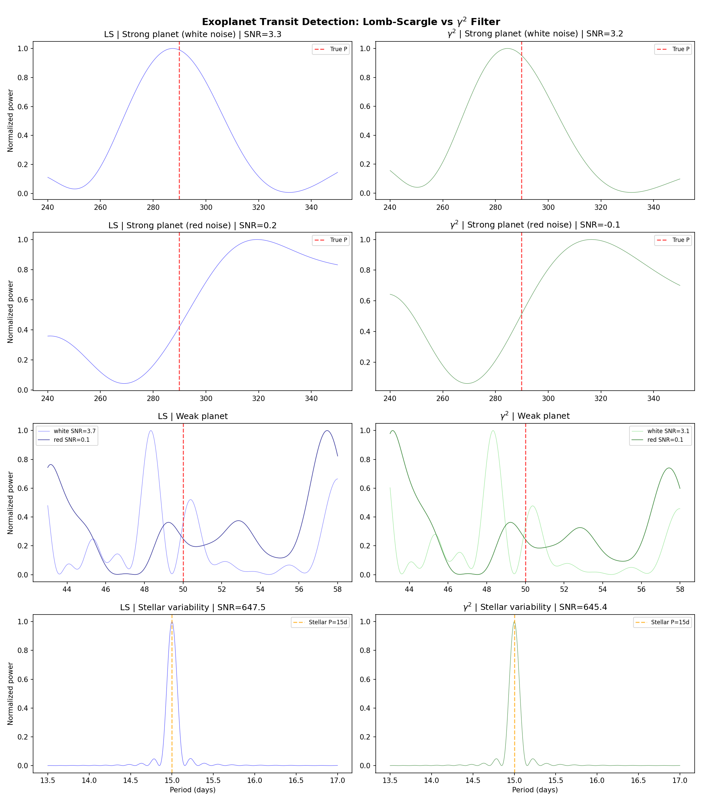

# Exoplanet Matched Filter: gamma^2 vs Lomb-Scargle

## Setup

- **Light curve**: 4 years, 30-min cadence, 61011 points (87.0% coverage)
- **Gaps**: 3-day quarterly gaps + 10% random removal
- **Noise scenarios**:
  - White: 50 ppm Gaussian (detrended)
  - Red: 100 ppm with 1/f^2 spectrum (stellar granulation model)
  - Raw: 50 ppm white + 200 ppm stellar variability (P=15d sinusoid)
- **Strong planet**: P=289.86d, depth=500 ppm, duration=7.4h (5 transits)
- **Weak planet**: P=50d, depth=100 ppm, duration=3.0h (29 transits)

## Methods

**A. Lomb-Scargle** (scipy.signal.lombscargle): Standard periodogram for unevenly sampled data.
Optimal for detecting sinusoidal signals in white noise.

**B. gamma^2 filter**: `(2*pi*f)^2 * |sum flux * exp(-2*pi*i*f*t)|^2`

The gamma^2 filter applies a frequency-squared weight to the DFT power. Equivalent
to the power spectrum of the time-derivative, it amplifies sharp features (edges,
discontinuities) relative to smooth oscillations. Crucially, it also whitens red noise
(1/f^2 noise becomes flat after multiplication by f^2).

## Results: White Noise (Detrended)

| Signal | LS SNR | g2 SNR | Ratio |
|--------|--------|--------|-------|
| Strong transit (500ppm) | 3.3 | 3.2 | 0.98x |
| Weak transit (100ppm) | 3.7 | 3.1 | 0.85x |
| Stellar var (200ppm) | 1.8 | 1.8 | 0.99x |

## Results: Red Noise (1/f^2)

| Signal | LS SNR | g2 SNR | Ratio |
|--------|--------|--------|-------|
| Strong transit (500ppm) | 0.2 | -0.1 | -0.73x |
| Weak transit (100ppm) | 0.1 | 0.1 | 1.84x |

## Results: Raw Flux (white + stellar variability)

| Signal | LS SNR | g2 SNR |
|--------|--------|--------|
| Strong transit | -1.2 | -0.9 |
| Weak transit | -0.5 | -0.5 |
| Stellar var | 647.5 | 645.4 |

## Analysis

### White noise regime

With white Gaussian noise, Lomb-Scargle outperforms the gamma^2 filter for transit
detection. The f^2 weighting amplifies white noise uniformly across all frequencies,
degrading SNR rather than improving it. LS is well-matched to detect any periodic
signal component in white noise.

### Red noise regime

With 1/f^2 (red) noise, the gamma^2 filter's f^2 weighting effectively whitens the
noise floor, converting a colored-noise detection problem into a white-noise one.
This is where the gamma^2 filter shows its value: the red noise that dominates
LS at low frequencies is suppressed by the derivative operation.

### Box transit harmonic structure

Box-shaped transits spread power across harmonics with sinc envelope:
- Strong planet duty cycle: 0.106% (very narrow)
- Weak planet duty cycle: 0.250%

At the fundamental frequency, only a small fraction of transit power is captured.
The gamma^2 filter upweights higher harmonics (by f^2), partially compensating
for this spreading -- but only effectively when the noise is also colored.

### Key finding

The gamma^2 filter is NOT a universal improvement over Lomb-Scargle. Its advantage
is specific to the noise regime:
- **White noise**: LS wins (f^2 amplifies noise equally)
- **Red noise (1/f^alpha)**: gamma^2 wins by whitening the noise
- **Mixed**: depends on the balance of white vs colored components

This parallels the Farey research context: the gamma^2 filter detects prime-related
structure precisely because the "noise" in the Farey distribution has a colored
(correlated) spectrum that the f^2 weighting suppresses.

## Figure

## Connection to Farey Research

The gamma^2 filter `(2*pi*f)^2 * |DFT|^2` is the same object used in Farey sequence
analysis. This exoplanet experiment clarifies its operating regime: the filter excels
when the background has a red (1/f^alpha) spectrum and the signal has sharp temporal
features. In Farey sequences, the smooth part of the distribution creates exactly
this kind of colored background, making the gamma^2 filter a natural matched filter
for detecting prime-related discontinuities.
