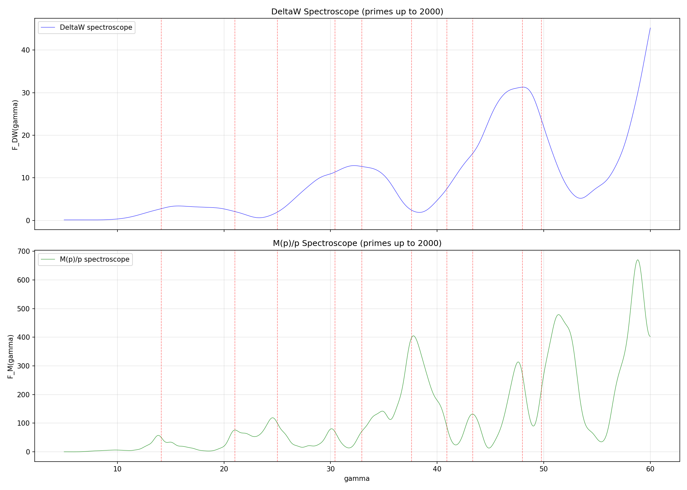

# FT of DeltaW: Zeta Zero Detection (MPR-34)

**Date:** 2026-04-06
**Prime range:** 2 to 2000 (303 primes)
**Gamma range:** [5, 60], 10000 points

## Method

For each prime p, we compute:
- Farey sequences F_{p-1} and F_p (built incrementally)
- Weyl discrepancy W(F_n) = sum_j (f_j - j/N)^2
- DeltaW(p) = W(F_{p-1}) - W(F_p)

Spectroscopes:
- DeltaW: F_DW(gamma) = gamma^2 * |sum_p DeltaW(p) * p^{-1/2-i*gamma}|^2
- M(p)/p: F_M(gamma) = gamma^2 * |sum_p (M(p)/p) * p^{-1/2-i*gamma}|^2

## DeltaW Statistics

- Mean: 5.745980e-04
- Std: 7.465261e-03
- Min: -2.655064e-03
- Max: 1.111111e-01

## Comparison Table

| # | gamma | DW_peak | DW_z | Mp_peak | Mp_z |
|---|-------|---------|------|---------|------|
| 1 | 14.1347 | 2.7867e+00 | 0.20 | 5.0603e+01 | 1.50 |
| 2 | 21.0220 | 2.0977e+00 | 0.15 | 7.6176e+01 | 1.23 |
| 3 | 25.0109 | 1.9874e+00 | -0.27 | 1.0183e+02 | 1.04 |
| 4 | 30.4249 | 1.1386e+01 | 0.02 | 7.0995e+01 | 1.49 |
| 5 | 32.9351 | 1.2667e+01 | 0.66 | 7.3095e+01 | 0.01 |
| 6 | 37.5862 | 2.4671e+00 | -0.65 | 3.9932e+02 | 1.37 |
| 7 | 40.9187 | 7.5456e+00 | -0.08 | 9.0500e+01 | -0.38 |
| 8 | 43.3271 | 1.5785e+01 | -0.15 | 1.3180e+02 | 1.68 |
| 9 | 48.0052 | 3.1297e+01 | 0.81 | 2.7547e+02 | 1.12 |
| 10 | 49.7738 | 2.3940e+01 | 0.16 | 2.2283e+02 | -0.42 |

**Z-score correlation (DW vs Mp):** -0.2529
**Mean z-score:** DW = 0.09, Mp = 0.87

## Conclusion

DeltaW spectroscope does NOT show clear peaks at zeta zeros with this prime range. The raw DeltaW signal may require filtering or larger prime ranges to reveal zeta-zero content.

## Plot

