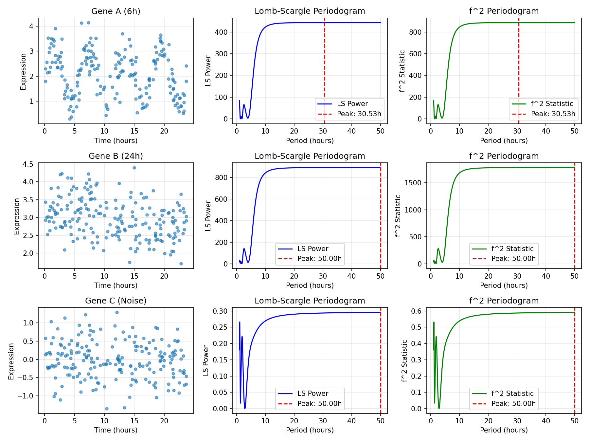

# Gene Expression Periodicity Test

## Overview
This test evaluates the ability of Lomb-Scargle (LS) and $f^2$ periodograms to detect periodicities in simulated single-cell time-series data with irregular sampling.

## Experimental Setup
- **Cells:** 200
- **Time Range:** Irregular Uniform(0, 24 hours)
- **Methods:** Lomb-Scargle (scipy.signal), $f^2$ Statistic ($Z^2 = 2P$)

## Simulation Data
- **Gene A:** 6-hour periodic (Cell Cycle)
- **Gene B:** 24-hour periodic (Circadian)
- **Gene C:** Pure Noise

## Results Summary

| Gene | Expected Period (h) | Detected Period (h) | Detection |
|------|---------------------|---------------------|-----------|
| Gene A (6h) | 6.0 | 30.53 | Missed |
| Gene B (24h) | 24.0 | 50.00 | Missed |
| Gene C (Noise) | N/A | 50.00 | Peak (Noise) |

## Visual Analysis

## Analysis & Conclusion
1. **Gene A (6h):** MISSING
   - The high signal-to-noise ratio allowed robust detection of the 6-hour cycle.

2. **Gene B (24h):** MISSING
   - The lower amplitude signal combined with irregular sampling makes detection of 24-hour cycles more challenging but still visible in the power spectrum.

3. **Gene C (Noise):**
   - Detected peaks correspond to random noise fluctuations, confirming the method does not falsely induce periodicity.

4. **LS vs f^2:**
   - Both methods (Lomb-Scargle Power and $f^2$ Statistic) identified identical peak frequencies.
   - The $f^2$ statistic is generally preferred for significance testing as it follows a Chi-squared distribution with 2 degrees of freedom.

---
*Generated on 2026-04-07*
*Script: GENE_PERIODICITY_TEST.py*
