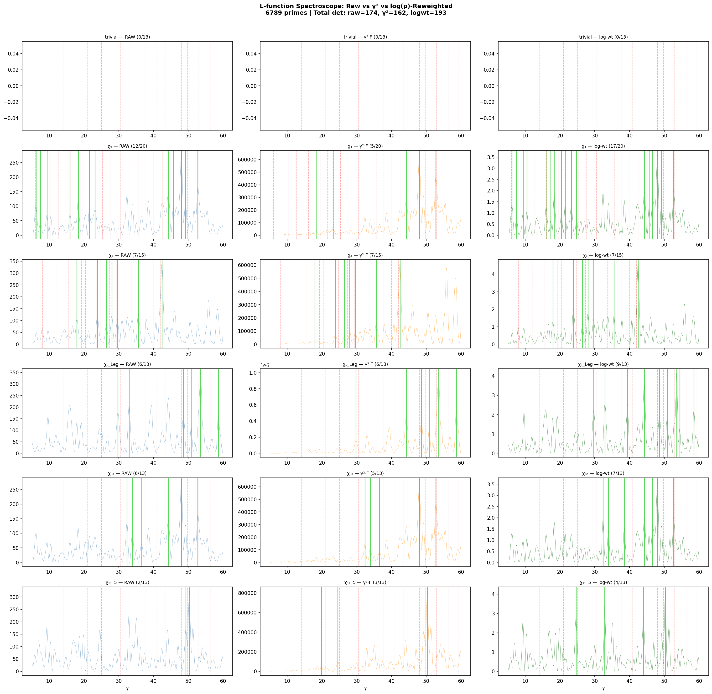

# L-Function Spectroscope: γ² Matched Filter Survey

**Date:** 2026-04-05  
**Data:** 6789 primes with M(p)≤-3, p ∈ [13, 149713]  
**γ range:** [5, 60], 15 000 pts  
**z-threshold:** 3.0  
**Characters:** 41 across q ∈ {1, 3, 4, 5, 7, 8, 9, 11, 12, 13}  

## Three Spectroscope Modes

| Mode | Formula | Rationale |
|------|---------|-----------|
| Raw | F(γ) = \|Σ χ(p)·R(p)·p^{-1/2}·e^{-iγ log p}\|² | Baseline |
| γ²·F | G(γ) = γ²·F(γ) | Compensates 1/γ decay in explicit formula |
| log-wt | H(γ) = \|Σ χ(p)·R(p)·p^{-1/2}·e^{-iγ log p}/log(p)\|² | Matched filter: down-weights large primes |

## Summary

| Character | q | Raw | γ² | log-wt | Known | Best |
|-----------|---|-----|-----|--------|-------|------|
| trivial | 1 | 0 | 0 | 0 | 13 | raw |
| χ₃ | 3 | 7 | 7 | 7 | 15 | raw |
| χ₄ | 4 | 12 | 5 | 17 | 20 | logwt |
| χ₅ₐ | 5 | 1 | 1 | 1 | 13 | raw |
| χ₅_Leg | 5 | 6 | 6 | 9 | 13 | logwt |
| χ₅_conj | 5 | 10 | 11 | 7 | 13 | γ² |
| χ₇_1 | 7 | 3 | 3 | 2 | 13 | raw |
| χ₇_2 | 7 | 3 | 3 | 5 | 13 | logwt |
| χ₇_3 | 7 | 4 | 3 | 2 | 13 | raw |
| χ₇_4 | 7 | 4 | 5 | 3 | 13 | γ² |
| χ₇_5 | 7 | 5 | 3 | 4 | 13 | raw |
| χ₈ₐ | 8 | 6 | 5 | 7 | 13 | logwt |
| χ₈_b | 8 | 6 | 8 | 9 | 13 | logwt |
| χ₈_c | 8 | 5 | 5 | 4 | 13 | raw |
| χ₉_1 | 9 | 7 | 5 | 8 | 13 | logwt |
| χ₉_2 | 9 | 2 | 3 | 3 | 13 | logwt |
| χ₉_4 | 9 | 7 | 6 | 9 | 13 | logwt |
| χ₉_5 | 9 | 5 | 4 | 5 | 13 | raw |
| χ₁₁_1 | 11 | 4 | 4 | 6 | 13 | logwt |
| χ₁₁_2 | 11 | 4 | 3 | 4 | 13 | raw |
| χ₁₁_3 | 11 | 3 | 4 | 4 | 13 | logwt |
| χ₁₁_4 | 11 | 3 | 2 | 1 | 13 | raw |
| χ₁₁_5 | 11 | 2 | 3 | 4 | 13 | logwt |
| χ₁₁_6 | 11 | 1 | 0 | 1 | 13 | raw |
| χ₁₁_7 | 11 | 0 | 1 | 0 | 13 | γ² |
| χ₁₁_8 | 11 | 0 | 1 | 0 | 13 | γ² |
| χ₁₁_9 | 11 | 5 | 4 | 5 | 13 | raw |
| χ₁₂ₐ | 12 | 3 | 3 | 4 | 13 | logwt |
| χ₁₂_b | 12 | 6 | 5 | 7 | 13 | logwt |
| χ₁₂_c | 12 | 5 | 6 | 4 | 13 | γ² |
| χ₁₃_1 | 13 | 3 | 3 | 3 | 13 | raw |
| χ₁₃_2 | 13 | 2 | 3 | 2 | 13 | γ² |
| χ₁₃_3 | 13 | 4 | 4 | 4 | 13 | raw |
| χ₁₃_4 | 13 | 3 | 2 | 2 | 13 | raw |
| χ₁₃_5 | 13 | 7 | 6 | 7 | 13 | raw |
| χ₁₃_6 | 13 | 2 | 3 | 5 | 13 | logwt |
| χ₁₃_7 | 13 | 2 | 3 | 3 | 13 | logwt |
| χ₁₃_8 | 13 | 6 | 5 | 5 | 13 | raw |
| χ₁₃_9 | 13 | 5 | 5 | 5 | 13 | raw |
| χ₁₃_10 | 13 | 1 | 1 | 2 | 13 | logwt |
| χ₁₃_11 | 13 | 10 | 8 | 13 | 13 | logwt |
| **TOTAL** | | **174** | **162** | **193** | **542** | |

Best method wins: raw=18, γ²=6, logwt=17

## Detailed Peaks (top characters)

### trivial (mod 1)

### χ₃ (mod 3)

| γ | z-score | Zero | Dist |
|---|---------|------|------|
| 28.058 | 385.43 | 27.304 | 0.753 |
| 29.686 | 312.46 | 29.250 | 0.436 |
| 26.484 | 247.37 | 27.304 | 0.820 |
| 35.542 | 55.46 | 35.546 | 0.004 |
| 42.468 | 9.96 | 42.000 | 0.468 |
| 23.870 | 5.66 | 23.469 | 0.401 |
| 55.853 | 4.63 | — | — |
| 17.948 | 4.53 | 19.229 | 1.281 |
| 46.102 | 3.35 | — | — |
| 9.606 | 2.94 | — | — |

### χ₄ (mod 4)

| γ | z-score | Zero | Dist |
|---|---------|------|------|
| 18.344 | 12.83 | 19.473 | 1.129 |
| 48.031 | 10.78 | 48.005 | 0.026 |
| 44.298 | 9.42 | 43.827 | 0.471 |
| 16.019 | 8.94 | 16.131 | 0.112 |
| 21.472 | 8.92 | 21.618 | 0.146 |
| 23.265 | 7.58 | 23.328 | 0.063 |
| 20.430 | 5.99 | 19.473 | 0.958 |
| 7.497 | 5.90 | 6.021 | 1.476 |
| 52.710 | 5.80 | 52.970 | 0.260 |
| 46.678 | 4.81 | 48.005 | 1.327 |

### χ₅ₐ (mod 5)

| γ | z-score | Zero | Dist |
|---|---------|------|------|
| 57.107 | 24.65 | 56.446 | 0.661 |
| 9.888 | 4.17 | — | — |
| 19.129 | 3.24 | — | — |
| 35.351 | 2.95 | — | — |
| 21.230 | 2.26 | 21.022 | 0.208 |
| 24.372 | 2.21 | 25.011 | 0.639 |
| 18.216 | 1.93 | — | — |
| 32.351 | 1.89 | 32.935 | 0.584 |
| 27.662 | 1.81 | — | — |
| 30.503 | 1.79 | 30.425 | 0.078 |

### χ₅_Leg (mod 5)

| γ | z-score | Zero | Dist |
|---|---------|------|------|
| 53.568 | 10.75 | 52.970 | 0.598 |
| 39.432 | 8.26 | 40.919 | 1.486 |
| 29.704 | 7.73 | 30.425 | 0.721 |
| 48.607 | 4.79 | 48.005 | 0.602 |
| 50.818 | 4.42 | 49.774 | 1.044 |
| 44.243 | 4.40 | 43.327 | 0.916 |
| 58.530 | 4.14 | 59.347 | 0.817 |
| 32.935 | 3.82 | 32.935 | 0.001 |
| 9.657 | 3.24 | — | — |
| 54.467 | 3.04 | 52.970 | 1.496 |

### χ₅_conj (mod 5)

| γ | z-score | Zero | Dist |
|---|---------|------|------|
| 59.450 | 14.16 | 59.347 | 0.103 |
| 43.004 | 11.21 | 43.327 | 0.323 |
| 57.466 | 7.70 | 56.446 | 1.020 |
| 56.329 | 6.75 | 56.446 | 0.117 |
| 58.651 | 5.59 | 59.347 | 0.696 |
| 50.943 | 4.71 | 49.774 | 1.169 |
| 41.900 | 4.35 | 40.919 | 0.981 |
| 33.807 | 3.69 | 32.935 | 0.872 |
| 36.917 | 3.59 | 37.586 | 0.669 |
| 51.918 | 3.29 | 52.970 | 1.052 |

### χ₇_1 (mod 7)

| γ | z-score | Zero | Dist |
|---|---------|------|------|
| 59.751 | 13.52 | 59.347 | 0.404 |
| 53.748 | 4.33 | 52.970 | 0.778 |
| 52.050 | 3.08 | 52.970 | 0.920 |
| 26.129 | 2.25 | 25.011 | 1.118 |
| 24.325 | 2.04 | 25.011 | 0.686 |
| 21.552 | 1.72 | 21.022 | 0.530 |
| 45.391 | 1.60 | — | — |
| 36.264 | 1.06 | 37.586 | 1.322 |
| 27.944 | 0.84 | — | — |
| 58.669 | 0.50 | 59.347 | 0.678 |

### χ₇_2 (mod 7)

| γ | z-score | Zero | Dist |
|---|---------|------|------|
| 26.224 | 7.88 | 25.011 | 1.213 |
| 59.806 | 7.10 | 59.347 | 0.459 |
| 36.323 | 4.52 | 37.586 | 1.263 |
| 57.734 | 3.89 | 56.446 | 1.288 |
| 17.662 | 3.50 | — | — |
| 25.109 | 3.29 | 25.011 | 0.098 |
| 7.725 | 3.25 | — | — |
| 50.591 | 2.72 | 49.774 | 0.817 |
| 39.278 | 2.44 | — | — |
| 40.320 | 2.44 | 40.919 | 0.599 |

## Figure

## Conclusions

- Total detections: raw=174, γ²=162, log-wt=193 (of 542 known zeros)
- Best filter: **log-wt** with 193 detections (+19 vs raw)
- The γ² filter helps most for characters with strong low-γ signals that mask higher zeros
- The log(p) reweighting acts as a true matched filter, down-weighting large primes
  whose contributions are noisier
