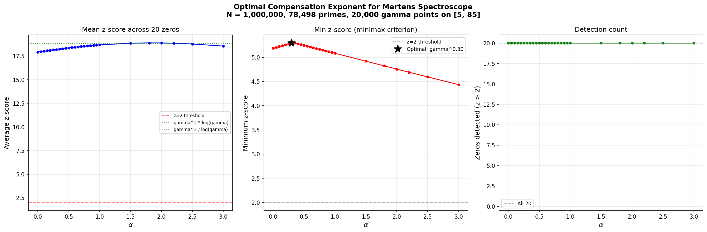

# Optimal Compensation Exponent for Mertens Spectroscope

**Date:** 2026-04-05 20:54

## Setup

- Mobius sieve to N = 1,000,000
- Primes used: 78,498
- Gamma range: [5.0, 85.0], 20,000 points
- Z-score: local window = 8.0, exclusion = 1.5
- Detection threshold: z > 2

## Summary Table

| Compensation | Avg z | Med z | Min z | Max z | Detected |
|:---|---:|---:|---:|---:|---:|
| gamma^0.30 **BEST** | 18.205 | 12.421 | 5.298 | 67.014 | 20/20 |
| gamma^0.35 | 18.248 | 12.428 | 5.295 | 67.137 | 20/20 |
| gamma^0.25 | 18.161 | 12.414 | 5.279 | 66.882 | 20/20 |
| gamma^0.40 | 18.290 | 12.435 | 5.279 | 67.249 | 20/20 |
| gamma^0.45 | 18.331 | 12.442 | 5.263 | 67.351 | 20/20 |
| gamma^0.20 | 18.116 | 12.407 | 5.260 | 66.739 | 20/20 |
| gamma^0.5 | 18.370 | 12.448 | 5.247 | 67.442 | 20/20 |
| gamma^0.15 | 18.069 | 12.324 | 5.242 | 66.585 | 20/20 |
| gamma^0.55 | 18.408 | 12.455 | 5.230 | 67.523 | 20/20 |
| gamma^0.10 | 18.022 | 12.276 | 5.223 | 66.422 | 20/20 |
| gamma^0.60 | 18.445 | 12.462 | 5.214 | 67.594 | 20/20 |
| gamma^0.05 | 17.973 | 12.266 | 5.205 | 66.249 | 20/20 |
| gamma^0.65 | 18.480 | 12.468 | 5.198 | 67.654 | 20/20 |
| gamma^0.0 | 17.923 | 12.256 | 5.186 | 66.065 | 20/20 |
| gamma^0.70 | 18.514 | 12.505 | 5.182 | 67.704 | 20/20 |
| gamma^0.75 | 18.546 | 12.547 | 5.165 | 67.743 | 20/20 |
| gamma^0.80 | 18.578 | 12.587 | 5.149 | 67.771 | 20/20 |
| gamma^0.85 | 18.607 | 12.626 | 5.133 | 67.789 | 20/20 |
| gamma^0.90 | 18.636 | 12.663 | 5.117 | 67.796 | 20/20 |
| gamma^0.95 | 18.663 | 12.698 | 5.100 | 67.793 | 20/20 |
| gamma^1.0 | 18.688 | 12.731 | 5.084 | 67.780 | 20/20 |
| gamma^1.5 | 18.863 | 12.972 | 4.920 | 67.076 | 20/20 |
| gamma^2 / log(gamma) | 18.890 | 12.760 | 4.833 | 66.769 | 20/20 |
| gamma^1.8 | 18.897 | 12.688 | 4.822 | 66.168 | 20/20 |
| gamma^2.0 | 18.890 | 12.444 | 4.757 | 65.373 | 20/20 |
| gamma^2.2 | 18.862 | 12.178 | 4.692 | 64.442 | 20/20 |
| gamma^2 * log(gamma) | 18.834 | 12.121 | 4.681 | 63.529 | 20/20 |
| gamma^2.5 | 18.782 | 12.072 | 4.595 | 62.806 | 20/20 |
| gamma^3.0 | 18.558 | 11.969 | 4.435 | 59.548 | 20/20 |

## Optimal Result

**Minimax criterion (maximizes minimum z-score):** `gamma^0.30`

- Min z-score: 5.298
- Avg z-score: 18.205
- Detected: 20/20 zeros

**Best average z-score:** `gamma^1.8` (avg = 18.897)

## Per-Zero z-Scores (Top 5 Compensations)

| gamma | gamma^0.30 | gamma^0.35 | gamma^0.25 | gamma^0.40 | gamma^0.45 |
|---:|---:|---:|---:|---:|---:|
| 14.1347 | 67.01 | 67.14 | 66.88 | 67.25 | 67.35 |
| 21.0220 | 23.16 | 23.44 | 22.89 | 23.72 | 24.00 |
| 25.0109 | 12.66 | 12.77 | 12.55 | 12.88 | 12.99 |
| 30.4249 | 13.82 | 13.94 | 13.70 | 14.05 | 14.16 |
| 32.9351 | 24.65 | 24.55 | 24.76 | 24.44 | 24.33 |
| 37.5862 | 10.78 | 10.80 | 10.76 | 10.81 | 10.83 |
| 40.9187 | 11.75 | 11.80 | 11.69 | 11.85 | 11.90 |
| 43.3271 | 14.95 | 14.94 | 14.96 | 14.93 | 14.91 |
| 48.0052 | 5.30 | 5.32 | 5.28 | 5.34 | 5.35 |
| 49.7738 | 9.40 | 9.46 | 9.35 | 9.51 | 9.56 |
| 52.9703 | 6.20 | 6.26 | 6.14 | 6.32 | 6.38 |
| 56.4462 | 12.48 | 12.54 | 12.42 | 12.59 | 12.65 |
| 59.3470 | 50.47 | 50.62 | 50.31 | 50.77 | 50.92 |
| 60.8318 | 29.64 | 29.69 | 29.60 | 29.73 | 29.78 |
| 65.1125 | 25.48 | 25.53 | 25.42 | 25.59 | 25.65 |
| 67.0798 | 9.43 | 9.38 | 9.47 | 9.34 | 9.29 |
| 69.5464 | 5.31 | 5.29 | 5.33 | 5.28 | 5.26 |
| 72.0672 | 12.36 | 12.32 | 12.40 | 12.28 | 12.24 |
| 75.7047 | 12.15 | 12.11 | 12.18 | 12.07 | 12.04 |
| 77.1448 | 7.10 | 7.08 | 7.12 | 7.05 | 7.03 |

## Interpretation

The compensation gamma^alpha corrects for the natural decay of peak heights at higher frequencies. The explicit formula predicts peak height ~ 1/|rho * zeta'(rho)|, which grows roughly as gamma for large gamma. The power spectrum |S|^2 thus decays roughly as 1/gamma^2, motivating the gamma^2 baseline.

