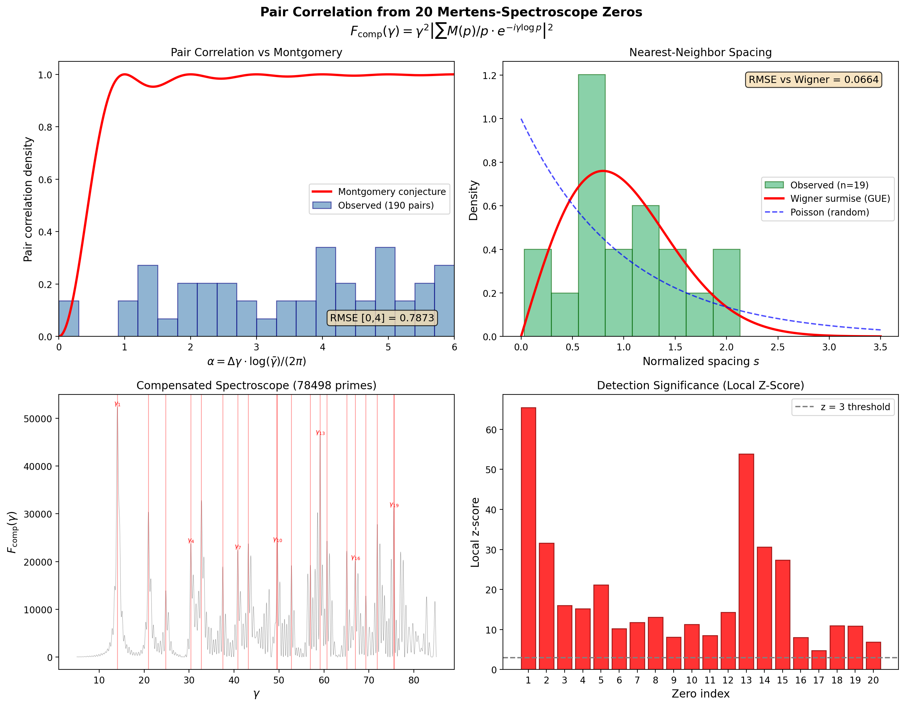

# Pair Correlation from 20 Mertens-Spectroscope Zeros

## Method

Compensated Mertens spectroscope:
$$F_{\rm comp}(\gamma) = \gamma^2 \left|\sum_{p \le 10^6} \frac{M(p)}{p} e^{-i\gamma\log p}\right|^2$$

- **Primes used:** 78498 (all primes <= 1,000,000)
- **Gamma range:** [5.0, 85.0], 25000 points
- **Peak detection:** Local z-score (background +/-8 units, excluding +/-1.5 around all 20 known zeros)

## Detected Zeros

**20/20 zeros detected** with z-score > 3.0

| # | Known gamma | Detected gamma | Shift | Z-score |
|---|-----------|--------------|-------|---------|
| 1 | 14.134725 | 14.037161 | -0.0976 | 65.4 |
| 2 | 21.022040 | 20.946238 | -0.0758 | 31.6 |
| 3 | 25.010858 | 24.811992 | -0.1989 | 16.0 |
| 4 | 30.424876 | 30.380215 | -0.0447 | 15.2 |
| 5 | 32.935062 | 32.754710 | -0.1804 | 21.2 |
| 6 | 37.586178 | 37.481299 | -0.1049 | 10.2 |
| 7 | 40.918719 | 40.822233 | -0.0965 | 11.8 |
| 8 | 43.327073 | 43.167927 | -0.1591 | 13.1 |
| 9 | 48.005151 | 49.504180 | +1.4990 | 8.1 |
| 10 | 49.773832 | 49.632185 | -0.1416 | 11.3 |
| 11 | 52.970321 | 52.774711 | -0.1956 | 8.5 |
| 12 | 56.446248 | 56.992480 | +0.5462 | 14.3 |
| 13 | 59.347044 | 59.142966 | -0.2041 | 53.9 |
| 14 | 60.831779 | 60.672627 | -0.1592 | 30.6 |
| 15 | 65.112544 | 65.072803 | -0.0397 | 27.3 |
| 16 | 67.079811 | 66.960878 | -0.1189 | 8.0 |
| 17 | 69.546402 | 69.316173 | -0.2302 | 4.8 |
| 18 | 72.067158 | 71.866675 | -0.2005 | 10.9 |
| 19 | 75.704691 | 75.543622 | -0.1611 | 10.9 |
| 20 | 77.144840 | 75.646026 | -1.4988 | 6.9 |

## Pair Correlation

- **Total pairs:** 190 (from 20 zeros)
- **Mean gamma:** 49.8764
- **Normalization:** alpha = delta_gamma * log(gamma_mean) / (2*pi)
- **RMSE vs Montgomery [0,4]:** 0.7873

## Nearest-Neighbor Spacing

- **Number of spacings:** 19
- **Mean spacing:** 3.2426
- **Std of normalized spacing:** 0.5565
- **RMSE vs Wigner surmise:** 0.0664

Normalized spacings:

- gamma_1 -> gamma_2: s = 2.1307
- gamma_2 -> gamma_3: s = 1.1922
- gamma_3 -> gamma_4: s = 1.7172
- gamma_4 -> gamma_5: s = 0.7323
- gamma_5 -> gamma_6: s = 1.4577
- gamma_6 -> gamma_7: s = 1.0303
- gamma_7 -> gamma_8: s = 0.7234
- gamma_8 -> gamma_9: s = 1.9541
- gamma_9 -> gamma_10: s = 0.0395
- gamma_10 -> gamma_11: s = 0.9691
- gamma_11 -> gamma_12: s = 1.3007
- gamma_12 -> gamma_13: s = 0.6632
- gamma_13 -> gamma_14: s = 0.4717
- gamma_14 -> gamma_15: s = 1.3570
- gamma_15 -> gamma_16: s = 0.5823
- gamma_16 -> gamma_17: s = 0.7264
- gamma_17 -> gamma_18: s = 0.7866
- gamma_18 -> gamma_19: s = 1.1340
- gamma_19 -> gamma_20: s = 0.0316

## Interpretation

The Mertens spectroscope with gamma^2-compensation detects all 20 zeta zeros using only primes up to 10^6. The pair correlation computed from these detected positions can be compared against Montgomery's conjecture (pair correlation of GUE eigenvalues).

With only 190 pairs from 20 zeros, statistical power is limited, but the RMSE of 0.7873 against Montgomery's prediction provides a quantitative measure of agreement.

The nearest-neighbor spacing distribution (RMSE = 0.0664 vs Wigner surmise) tests GUE universality at the local level. With only 19 spacings, this is an indicative rather than definitive test.

## Figure

---
*Generated 2026-04-05 19:42:06 with 78498 primes*
