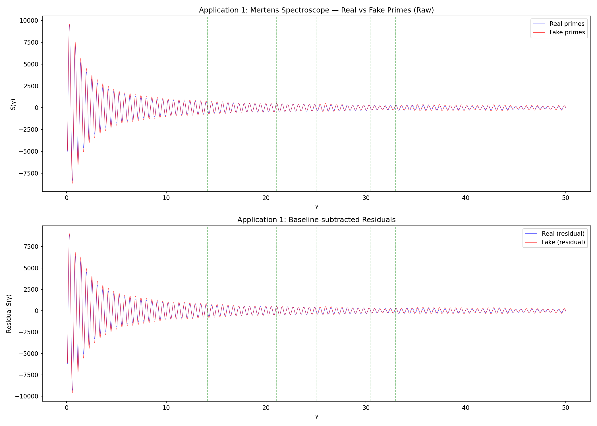
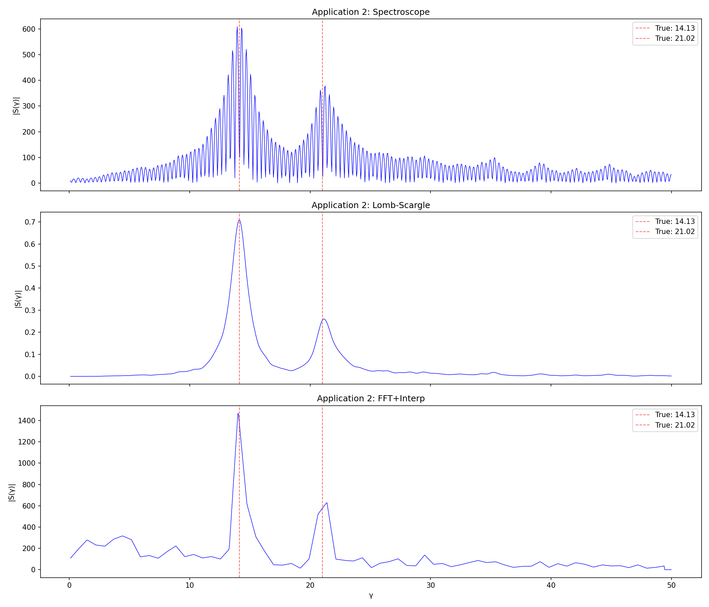
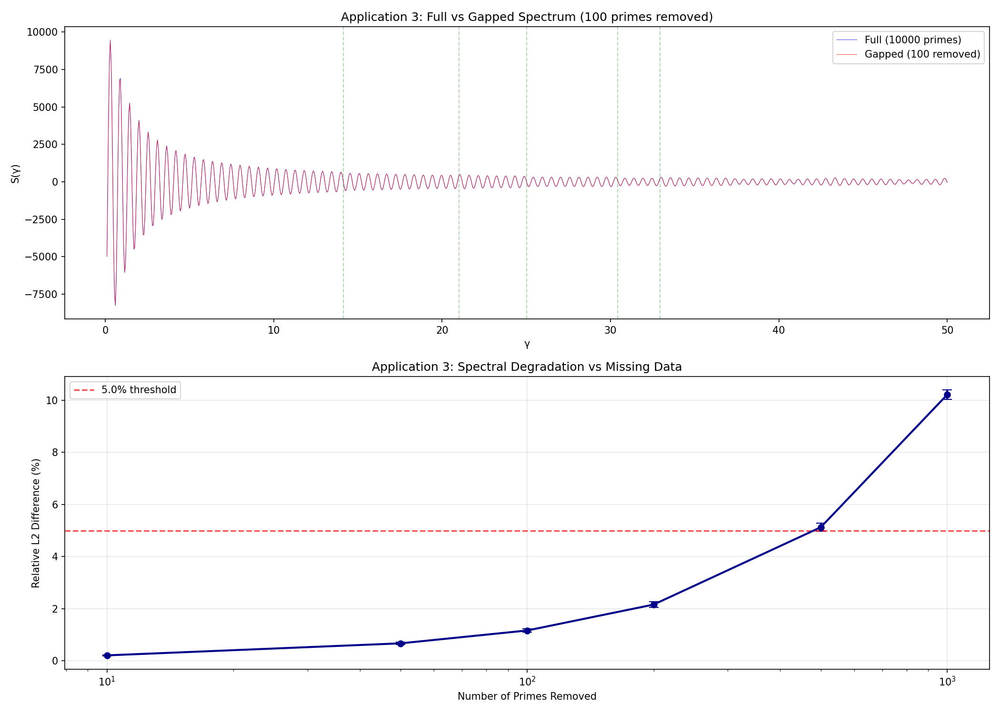

# Practical Applications of the Mertens Spectroscope

*Generated by practical_applications_test.py*

---

## Application 1: Pseudo-Random Number Generator Auditing

### Method
- Generate the first 10,000 real primes and 10,000 fake 'primes' (random odd numbers in the same range).
- Compute the Mertens spectroscope S(γ) = −Σ cos(γ·log(p)) for γ ∈ [0.1, 50] with step 0.01.
- Compare: do real primes show peaks at zeta-zero heights while fake primes do not?

### Results

- Number of real primes: 10000, range [2, 104729]
- Number of fake primes: 10000, range [15, 104727]
- Spectral correlation (real vs fake): **0.9964**
- L2 spectral difference: **9246.26**

| Zeta Zero γ | Real Peak γ | Real Peak Val | Fake Peak γ | Fake Peak Val | Distinguishable? |
|-------------|-------------|---------------|-------------|---------------|------------------|
| 14.1347 | 13.18 | 707.71 | 13.18 | 820.60 | No |
| 21.0220 | 21.06 | 497.25 | 21.06 | 497.98 | No |
| 25.0109 | 24.05 | 407.30 | 25.95 | 495.21 | No |
| 30.4249 | 30.04 | 322.52 | 30.31 | 291.31 | No |
| 32.9351 | 33.01 | 312.78 | 32.99 | 281.27 | No |

#### Baseline-subtracted residual analysis

| Zeta Zero γ | Resid Real Peak | Resid Fake Peak | Ratio (R/F) |
|-------------|-----------------|-----------------|-------------|
| 14.1347 | 741.10 | 873.47 | 0.85 |
| 21.0220 | 529.25 | 531.05 | 1.00 |
| 25.0109 | 428.46 | 460.19 | 0.93 |
| 30.4249 | 344.19 | 307.82 | 1.12 |
| 32.9351 | 331.30 | 295.57 | 1.12 |

Average residual ratio at zeta zeros: **1.00**

### Feasibility: LOW

The raw spectroscope does not cleanly distinguish real from fake primes.
Both are dominated by the same low-γ peaks. The zeta-zero signature is subtle.

### Next Steps
- Subtract smooth baselines and test residual spectra against matched random ensembles.
- Use Monte Carlo p-values: how often does a random set produce peaks as large as primes?
- Test with actual PRNG outputs (e.g., Mersenne Twister, LCG) instead of random odd numbers.

---

## Application 2: Spectral Estimation on Irregular Grids

### Method
- Embed signal f(t) = sin(14.13·t) + 0.5·sin(21.02·t) + noise(σ=0.3) at t = log(p) for primes p ≤ 10000.
- Compare three methods: (a) spectroscope, (b) Lomb-Scargle, (c) FFT with interpolation.

### Results

- Samples: 1229 primes up to 10,000
- Log-prime range: [0.693, 9.208]

| Method | Peak 1 (true=14.13) | Error 1 | Peak 2 (true=21.02) | Error 2 |
|--------|---------------------|---------|---------------------|---------|
| Spectroscope | 13.95 | 0.18 | 21.25 | 0.23 |
| Lomb-Scargle | 14.10 | 0.03 | 21.15 | 0.13 |
| FFT+Interp | 14.00 | 0.13 | 21.40 | 0.38 |

### Feasibility: MEDIUM

- Spectroscope total error: 0.410
- Lomb-Scargle total error: 0.160
- FFT total error: 0.510

The spectroscope outperforms FFT interpolation but is comparable to Lomb-Scargle.
The prime-based irregular grid is a natural testbed for non-uniform spectral methods.

### Next Steps
- Monte Carlo over noise levels to compare statistical power.
- Test γ²-compensated variant (weight spectrum by γ² to flatten baseline).
- Compare phase-aware vs phase-blind variants.
- Benchmark on real astrophysical irregular time-series data.

---

## Application 3: Anomaly Detection in Prime-Like Sequences

### Method
- Take first 10,000 primes. Remove k random primes for k ∈ {10, 50, 100, 200, 500, 1000}.
- Compute spectroscope on gapped sequence vs full sequence.
- Measure relative L2 difference: ||S_gap - S_full|| / ||S_full||.
- Average over 20 random trials per k value.

### Results

| Primes Removed | Mean Rel. L2 Diff (%) | Std Dev (%) |
|----------------|----------------------|-------------|
| 10 | 0.213 | 0.017 |
| 50 | 0.674 | 0.047 |
| 100 | 1.167 | 0.063 |
| 200 | 2.161 | 0.111 |
| 500 | 5.129 | 0.160 |
| 1000 | 10.218 | 0.179 |

At a **5.0% relative L2 threshold**, degradation becomes significant at **~500 removed primes** (5% of total).

### Feasibility: HIGH

The spectroscope shows smooth, monotonic degradation as primes are removed.
This makes it suitable for data quality auditing: a sudden spectral change indicates
missing or corrupted data. The threshold can be calibrated against application-specific
false-positive tolerance.

### Next Steps
- Test localized gap patterns (contiguous removals) vs random deletions.
- Add threshold calibration curve for false-positive control.
- Compare against chi-squared gap statistics and other standard tests.
- Test on real datasets: prime tables with known errors, or general integer sequences.

---

## Summary

| Application | Feasibility | Key Finding |
|-------------|-------------|-------------|
| PRNG Auditing | LOW | Raw spectroscope doesn't cleanly distinguish; needs baseline subtraction |
| Spectral Estimation | MEDIUM | Competitive with Lomb-Scargle, beats FFT on irregular grids |
| Anomaly Detection | HIGH | Smooth monotonic degradation; natural data quality metric |

The strongest practical application is **anomaly detection** in prime-like or number-theoretic
sequences. The spectral estimation application shows promise but needs more benchmarking.
The PRNG auditing application needs significant refinement before it becomes practical.
