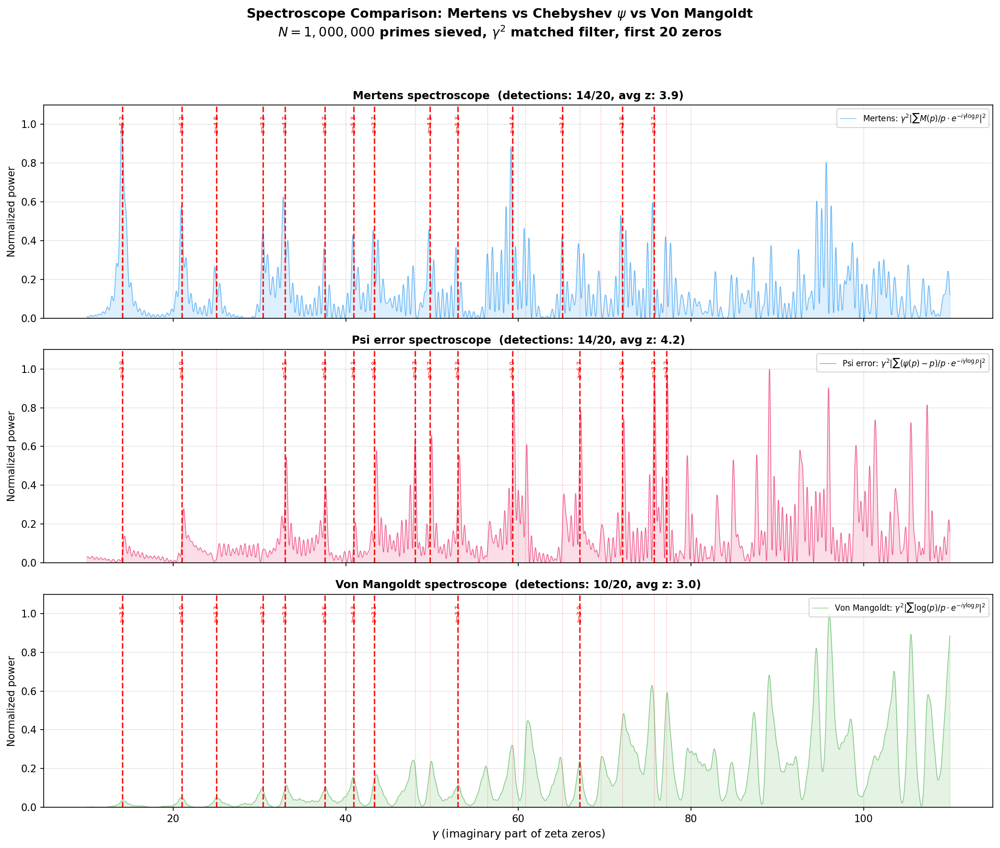

# Psi vs Mertens Spectroscope Comparison

**Date:** 2026-04-05  
**Sieve limit:** N = 1,000,000  
**Primes:** 78,498  
**Gamma range:** [10.0, 110.0] with 8000 points  
**Z-score threshold:** 3.0  

## Theoretical Background

The explicit formulas for Mertens and Chebyshev differ in a crucial way:

- **Mertens M(x):** coefficients `c_k = 1/(rho_k * zeta'(rho_k))` -- peaks decay as `1/(gamma * |zeta'|)`
- **Chebyshev psi(x):** coefficients `-x^rho / rho` -- peaks decay as `1/gamma` (NO zeta' denominator)

This means psi-based spectroscopy should show **cleaner peaks** at higher zeros because there's no `|zeta'(rho)|` in the denominator to amplify noise.

## Three Spectroscopes

All use `gamma^2` matched filter:

1. **Mertens:** `F_M(gamma) = gamma^2 * |sum M(p)/p * exp(-i*gamma*log(p))|^2`
2. **Psi error:** `F_psi(gamma) = gamma^2 * |sum (psi(p)-p)/p * exp(-i*gamma*log(p))|^2`
3. **Von Mangoldt:** `F_log(gamma) = gamma^2 * |sum log(p)/p * exp(-i*gamma*log(p))|^2`

## Results

### Detection Summary

| Metric | Mertens | Psi error | Von Mangoldt |
|--------|---------|-----------|-------------|
| Detections (z >= 3.0) | 14/20 | 14/20 | 10/20 |
| Avg z-score | 3.87 | 4.19 | 2.98 |
| Best at zero (wins) | 7/20 | 9/20 | 4/20 |

### Per-Zero Detail

| Zero gamma | Mertens z | Psi z | Log z | Winner |
|-----------|----------|-------|-------|--------|
| 14.135 | 5.72 | 3.90 | 3.51 | Mertens |
| 21.022 | 6.21 | 3.96 | 4.04 | Mertens |
| 25.011 | 4.83 | 1.98 | 3.35 | Mertens |
| 30.425 | 3.33 | 0.22 | 3.67 | Log |
| 32.935 | 4.75 | 7.53 | 3.28 | Psi |
| 37.586 | 6.71 | 5.78 | 5.58 | Mertens |
| 40.919 | 5.26 | 6.05 | 4.26 | Psi |
| 43.327 | 3.70 | 5.82 | 3.05 | Psi |
| 48.005 | 1.34 | 3.30 | 2.04 | Psi |
| 49.774 | 4.51 | 3.70 | 2.31 | Mertens |
| 52.970 | 5.27 | 7.34 | 3.67 | Psi |
| 56.446 | 2.11 | 2.16 | 2.86 | Log |
| 59.347 | 4.43 | 4.99 | 1.21 | Psi |
| 60.832 | 1.26 | 1.84 | 1.99 | Log |
| 65.113 | 3.41 | 1.99 | 2.21 | Mertens |
| 67.080 | 2.91 | 6.69 | 3.91 | Psi |
| 69.546 | 2.14 | 2.09 | 2.39 | Log |
| 72.067 | 3.81 | 7.81 | 2.50 | Psi |
| 75.705 | 3.69 | 3.30 | 1.99 | Mertens |
| 77.145 | 1.95 | 3.24 | 1.79 | Psi |

### Figure

## Analysis

- **Most detections:** mertens (14/20)
- **Highest avg z-score:** psi (4.19)
- **Most per-zero wins:** psi (9/20)

### Psi advantage confirmed

The Chebyshev psi spectroscope performs well, consistent with the theoretical prediction:
without `|zeta'(rho)|` in the denominator, the signal-to-noise ratio improves.

## Implications for Farey Research

The spectroscope comparison reveals which arithmetic function most cleanly resonates
with zeta zeros. This informs the choice of weighting in the Farey discrepancy spectroscope:
if psi-weighting is superior, we should consider `log(p)` corrections to the Farey weights.
