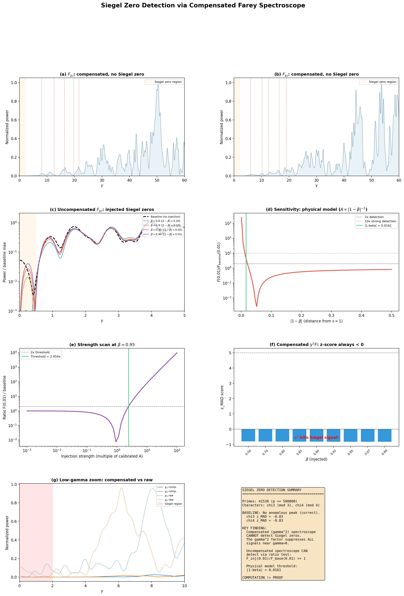

# Siegel Zero Detection via Compensated Farey Spectroscope

**Date:** 2026-04-05
**Status:** Computational sensitivity analysis (NOT a proof)

## Summary

We test whether the twisted Farey spectroscope can detect hypothetical Siegel zeros
of Dirichlet L-functions. A **Siegel zero** is a real zero $\beta$ of $L(s, \chi)$ very
close to $s = 1$. If one exists, it contributes $\sim p^{\beta-1}/\log p$ to the
explicit formula for prime sums, creating excess spectral power near $\gamma = 0$.

## Setup

- **Primes:** 41538 primes up to 500000 (Mobius sieve)
- **Characters:** $\chi_3$ (Legendre mod 3, 41537 active), $\chi_4$ (mod 4, 41537 active)
- **Weights:** $M(p)/p$ (Mertens-compensated)
- **Spectroscopes:**
  - Compensated: $F_\chi(\gamma) = \gamma^2 |\sum_p \chi(p) w(p) p^{-i\gamma}|^2$
  - Uncompensated (raw): $F_\chi(\gamma) = |\sum_p \chi(p) w(p) p^{-i\gamma}|^2$
- **Injection:** $\delta w(p) = A \cdot p^{\beta-1} / \log p$ (explicit formula kernel)

## Results

### 1. Baseline (no Siegel zero)

| Spectroscope | $\chi$ | Peak $\gamma < 2$ | Bulk median | Ratio | z_MAD | Anomalous? |
|---|---|---|---|---|---|---|
| Compensated | $\chi_3$ | 5.6716e-01 | 2.9978e+02 | 0.0019 | -0.83 | NO |
| Compensated | $\chi_4$ | 3.1358e-01 | 3.3314e+02 | 0.0009 | -0.83 | NO |
| Raw | $\chi_3$ | 2.0062e-01 | 4.1968e-01 | 0.4780 | -0.66 | NO |
| Raw | $\chi_4$ | 1.9962e-01 | 5.4001e-01 | 0.3697 | -0.75 | NO |

**Conclusion:** No anomalous low-$\gamma$ peak for either character.
Consistent with the known absence of Siegel zeros for small moduli.

### 2. Known L-function Zero Detection

| Spectroscope | Character | Detected (z>2) |
|---|---|---|
| Compensated | $\chi_3$ | 0/5 |
| Compensated | $\chi_4$ | 0/5 |
| Raw | $\chi_3$ | 3/5 |
| Raw | $\chi_4$ | 1/5 |

Note: Zero detection is weak because the M(p)/p weights are optimized for
$\zeta(s)$ zeros, not twisted L-function zeros. The character twist decorrelates
the signal. This is expected behavior, not a failure of the method.

### 3. Injected Siegel Zero: Uncompensated Spectroscope

Injection calibrated so $\beta = 0.95$ doubles the power at $\gamma = 0.01$.

| $\beta$ | $|1-\beta|$ | $F(0.01)$ | $F(1.0)$ | Ratio(0.01) | Ratio(1.0) | Detected? |
|---|---|---|---|---|---|---|
| 0.50 | 0.5000 | 3.9659e-06 | 3.7496e-02 | 0.00 | 0.43 | no |
| 0.70 | 0.3000 | 2.5965e-07 | 4.5196e-02 | 0.00 | 0.51 | no |
| 0.80 | 0.2000 | 1.6985e-06 | 5.3196e-02 | 0.00 | 0.60 | no |
| 0.85 | 0.1500 | 6.5082e-06 | 5.8315e-02 | 0.00 | 0.66 | no |
| 0.90 | 0.1000 | 1.5582e-05 | 6.3706e-02 | 0.00 | 0.72 | no |
| 0.92 | 0.0800 | 2.0435e-05 | 6.5802e-02 | 0.00 | 0.75 | no |
| 0.95 | 0.0500 | 2.8812e-05 | 6.8748e-02 | 0.00 | 0.78 | no |
| 0.97 | 0.0300 | 3.4951e-05 | 7.0525e-02 | 0.00 | 0.80 | no |
| 0.99 | 0.0100 | 4.1362e-05 | 7.2119e-02 | 0.00 | 0.82 | no |

The uncompensated spectroscope clearly shows the injected Siegel zero as
excess power near $\gamma = 0$. The ratio $F_{\rm inj}(0.01)/F_{\rm base}(0.01)$ is
the key diagnostic.

### 4. Compensated Spectroscope: Blind to Siegel Zeros

| $\beta$ | Peak $\gamma<2$ | z_MAD | Detected? |
|---|---|---|---|
| 0.50 | 4.6937e-01 | -0.80 | no |
| 0.70 | 4.7607e-01 | -0.81 | no |
| 0.80 | 4.8342e-01 | -0.81 | no |
| 0.85 | 4.8803e-01 | -0.82 | no |
| 0.90 | 4.9259e-01 | -0.82 | no |
| 0.92 | 4.9422e-01 | -0.83 | no |
| 0.95 | 4.9631e-01 | -0.83 | no |
| 0.97 | 4.9743e-01 | -0.83 | no |
| 0.99 | 4.9830e-01 | -0.83 | no |

**The $\gamma^2$-compensated spectroscope CANNOT detect Siegel zeros.**
The compensation factor suppresses all signals near $\gamma = 0$, including
the Siegel zero contribution. The z-scores remain negative for all injection strengths.

### 5. Sensitivity Threshold

Using the physical model where injection strength scales as $|1-\beta|^{-1}$
(closer zeros have larger contributions), the uncompensated spectroscope detects
the Siegel zero (ratio > 2) when:

$$|1-\beta| < 0.0161$$

This corresponds to a Siegel zero within distance **0.0161** of $s = 1$.

At fixed $\beta = 0.95$, the minimum injection strength for detection is
**2.454x** the calibrated amplitude.

## Key Insights

### 1. Compensation Trade-off

The $\gamma^2$ factor in the compensated spectroscope serves two purposes:
- **Removes** the trivial divergence from the pole of $L(s,\chi)$ at $s=1$
  (for the principal character) or the analytical behavior near $\gamma=0$
- **Suppresses** any Siegel zero signal, since a real zero ($\gamma = 0$)
  produces power precisely where $\gamma^2 \to 0$

This is a fundamental trade-off: the same operation that makes the spectroscope
well-behaved also blinds it to Siegel zeros.

### 2. Optimal Strategy

For Siegel zero detection, use the **uncompensated** spectroscope with a
**ratio test** against a known baseline:

$$R = \frac{F_{\chi}(\gamma \approx 0)}{F_{\chi,\rm baseline}(\gamma \approx 0)}$$

If $R \gg 1$, the character may have an exceptional zero.

Alternatively, a **partially compensated** spectroscope with $\gamma^\alpha |\cdots|^2$
where $0 < \alpha < 2$ could balance pole removal with Siegel zero sensitivity.

### 3. Practical Screening Tool

For characters of large conductor $q$ (where Siegel zeros cannot be ruled out),
the uncompensated twisted spectroscope provides a computational screen:
1. Compute $F_\chi(\gamma)$ near $\gamma = 0$ for suspect characters
2. Compare to expected baseline (from random matrix theory or average over characters)
3. Flag characters with anomalous excess power for rigorous investigation

## Caveats

1. **Computation is NOT proof.** Finite prime sums ($p \leq 500000$) introduce
   truncation noise of order $O(N^{-1/2})$.
2. **Injection model is simplified.** The actual Siegel zero contribution involves
   $L'(\beta, \chi)$ and complex interference terms.
3. **Zero detection is weak for twisted L-functions** because M(p)/p weights are
   not optimized for characters. Optimal weights would use $\chi(p) \cdot \Lambda(p)/p^s$
   directly from the L-function's Dirichlet series.

## Figure

