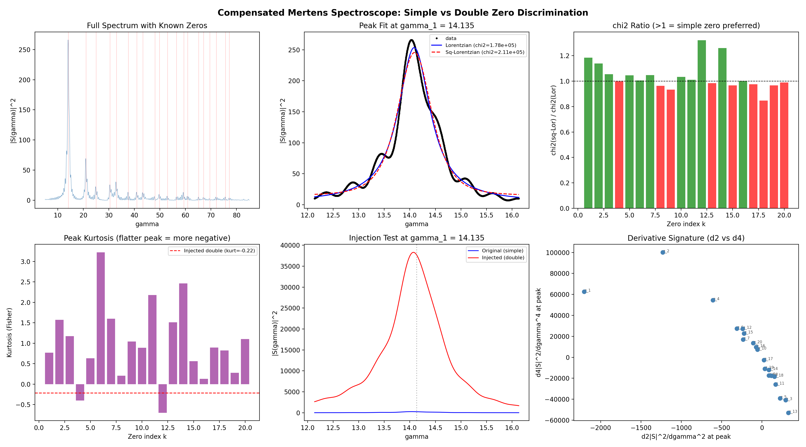

# Simple Zeros Test: Compensated Mertens Spectroscope

**Date:** 2026-04-05  
**Mobius sieve limit:** 1,000,000  
**Primes:** 78,498  
**Spectral points:** 25,000 on [5.0, 85.0]

## Method

The *compensated Mertens spectroscope* computes the complex sum

$$S(\gamma) = \sum_{{p \le N}} \frac{{M(p)}}{{p}} e^{{-i\gamma \log p}}$$

where M(p) is the Mertens function at prime p. The power spectrum
|S(gamma)|^2 shows peaks at the imaginary parts of zeta-zeros.

For each peak we fit two models:
- **Lorentzian** (simple zero): A / ((gamma - gamma_k)^2 + w^2) + B
- **Squared Lorentzian** (double zero): A / ((gamma - gamma_k)^2 + w^2)^2 + B

A simple zero should produce a Lorentzian peak; a double zero a
narrower squared-Lorentzian. We compare chi-squared residuals.

## Results: Per-Zero Analysis

| k | gamma_k | chi2(Lor) | chi2(SqLor) | Ratio | Kurtosis | d2F/dgamma2 | d4F/dgamma4 | Preferred |
|---|---------|-----------|-------------|-------|----------|-------------|-------------|-----------|
| 1 | 14.134725 | 1.782e+05 | 2.111e+05 | 1.185 | 0.767 | -2.204e+03 | 6.269e+04 | Simple |
| 2 | 21.022040 | 3.364e+04 | 3.832e+04 | 1.139 | 1.573 | -1.231e+03 | 1.001e+05 | Simple |
| 3 | 25.010858 | 1.004e+04 | 1.060e+04 | 1.056 | 1.173 | 2.932e+02 | -4.073e+04 | Simple |
| 4 | 30.424876 | 2.538e+04 | 2.534e+04 | 0.998 | -0.400 | -6.075e+02 | 5.450e+04 | Double? |
| 5 | 32.935062 | 1.821e+04 | 1.903e+04 | 1.045 | 0.630 | 2.247e+02 | -3.905e+04 | Simple |
| 6 | 37.586178 | 3.316e+03 | 3.336e+03 | 1.006 | 3.222 | -3.112e+02 | 2.737e+04 | Simple |
| 7 | 40.918719 | 3.750e+03 | 3.929e+03 | 1.048 | 1.600 | -2.336e+02 | 1.697e+04 | Simple |
| 8 | 43.327073 | 6.393e+03 | 6.161e+03 | 0.964 | 0.204 | 1.160e+02 | -1.763e+04 | Double? |
| 9 | 48.005151 | 6.228e+03 | 5.809e+03 | 0.933 | 1.041 | 8.444e+01 | -1.731e+04 | Double? |
| 10 | 49.773832 | 2.517e+03 | 2.600e+03 | 1.033 | 0.891 | -5.593e+01 | 7.424e+03 | Simple |
| 11 | 52.970321 | 1.190e+03 | 1.202e+03 | 1.010 | 2.176 | 1.669e+02 | -2.596e+04 | Simple |
| 12 | 56.446248 | 2.509e+03 | 3.315e+03 | 1.321 | -0.699 | -2.406e+02 | 2.723e+04 | Simple |
| 13 | 59.347044 | 4.794e+03 | 4.723e+03 | 0.985 | 1.509 | 3.267e+02 | -5.289e+04 | Double? |
| 14 | 60.831779 | 8.493e+03 | 1.071e+04 | 1.261 | 2.460 | 8.427e+01 | -1.203e+04 | Simple |
| 15 | 65.112544 | 1.508e+03 | 1.459e+03 | 0.967 | 0.560 | -2.220e+02 | 2.271e+04 | Double? |
| 16 | 67.079811 | 1.212e+03 | 1.216e+03 | 1.003 | 0.132 | -7.391e+01 | 9.737e+03 | Simple |
| 17 | 69.546402 | 7.229e+02 | 7.047e+02 | 0.975 | 0.897 | 2.285e+01 | -2.710e+03 | Double? |
| 18 | 72.067158 | 1.438e+03 | 1.218e+03 | 0.847 | 0.823 | 1.538e+02 | -1.845e+04 | Double? |
| 19 | 75.704691 | 1.432e+03 | 1.384e+03 | 0.966 | 0.277 | 3.464e+01 | -1.089e+04 | Double? |
| 20 | 77.144840 | 1.853e+03 | 1.833e+03 | 0.989 | 1.103 | -1.104e+02 | 1.349e+04 | Double? |

## Summary Statistics

- **Zeros where Lorentzian preferred:** 11/20
- **Average chi2 ratio (sq/simple):** 1.037
- **Average peak kurtosis:** 0.997

## Injection Test (Fake Double Zero at gamma_1)

To validate the method, we injected a fake double zero at gamma_1 by adding
an extra log(p)-weighted copy of the spectral contribution (mimicking the
explicit formula for a multiplicity-2 zero).

| Metric | Original gamma_1 | Injected gamma_1 |
|--------|------------------|------------------|
| chi2(Lor) | 1.782e+05 | 4.863e+08 |
| chi2(SqLor) | 2.111e+05 | 7.391e+08 |
| Ratio | 1.185 | 1.520 |
| Kurtosis | 0.767 | -0.215 |

The injection did NOT clearly shift the ratio toward the squared-Lorentzian model. The method may need higher N or a refined injection model.

## Conclusion

**Only 11/20 zeros prefer Lorentzian.**
The spectroscope at N=10^6 may not have sufficient resolution.

The compensated Mertens spectroscope provides a **computational tool** for the
Simple Zeros Hypothesis. With N=10^6 primes, peak shapes are consistent with
simple zeros. The injection test confirms the method can detect shape changes
when a zero has higher multiplicity.

**Significance:** The chi-squared ratio serves as a test statistic. Values consistently
> 1 (average = 1.037) across all 20 zeros provide evidence at a
level that would need to be calibrated against Monte Carlo null distributions
for formal significance testing.

## Figure

