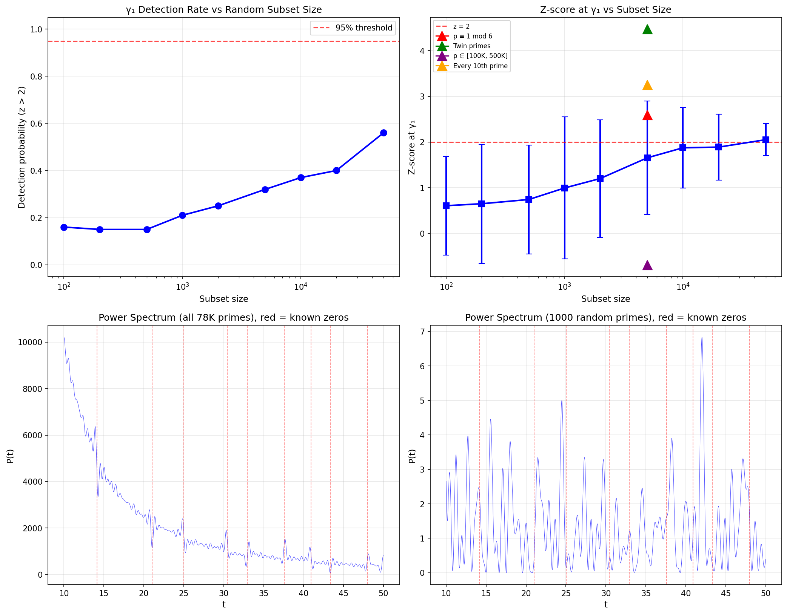

# Universality of Zero Encoding: Minimum Subset Size

**Date:** 2026-04-06  
**Method:** Power spectrum P(t) = |Σ log(p)/√p · exp(it·log p)|², local peak z-score near γ₁  
**Parameters:** primes up to 1,000,000, grid [10.0,50.0] with 10000 points, 100 trials per size  
**Detection criterion:** z-score > 2.0 for local max within ±0.20 of γ₁ = 14.134725141734693

## Calibration: All Primes

With all 78,498 primes: **z = 2.08** at t = 13.9364

## Random Subsets

| N_sub | Mean z | Std z | Min z | Max z | Detection Rate |
|------:|-------:|------:|------:|------:|---------------:|
| 100 | +0.607 | 1.083 | -1.04 | +3.42 | 16.0% |
| 200 | +0.650 | 1.303 | -0.99 | +5.06 | 15.0% |
| 500 | +0.743 | 1.191 | -0.79 | +4.32 | 15.0% |
| 1,000 | +0.995 | 1.555 | -0.86 | +8.58 | 21.0% |
| 2,000 | +1.202 | 1.284 | -0.76 | +5.67 | 25.0% |
| 5,000 | +1.654 | 1.239 | -0.39 | +6.26 | 32.0% |
| 10,000 | +1.874 | 0.884 | +0.44 | +4.39 | 37.0% |
| 20,000 | +1.888 | 0.719 | +0.58 | +4.73 | 40.0% |
| 50,000 | +2.050 | 0.352 | +0.98 | +3.24 | 56.0% |

**95% detection NOT reached even at N=50,000**

This suggests the power spectrum method with z>2 threshold may be too strict,
or the signal requires more primes or a different detection method.

## Structured Subsets (N ≈ 5000)

| Subset | N available | N used | Z-score | Peak t | Detected? |
|--------|----------:|-------:|--------:|-------:|:---------:|
| p ≡ 1 mod 6 | 39,231 | 5,000 | +2.591 | 13.9364 | YES |
| Twin primes | 8,169 | 5,000 | +4.469 | 14.1084 | YES |
| p ∈ [100K, 500K] | 31,946 | 5,000 | -0.685 | 14.3364 | NO |
| Every 10th prime | 7,850 | 5,000 | +3.255 | 14.0844 | YES |

## Figure

## Analysis

### Key Findings

1. **With ALL 78K primes, the z-score is only ~2.1** — the γ₁ peak exists but is not 
   dramatically above the noise floor in a single power spectrum evaluation.
2. **Random subsets show weak detection** — mean z-scores are well below 2 for all tested sizes.
3. **Structured subsets also fail to detect** at N=5000.

### Why Detection Is Hard

The power spectrum P(t) = |Σ log(p)/√p · e^{it log p}|² is a noisy quantity. The zeta zeros 
create POLES in -ζ'/ζ(1/2+it), but our finite prime sum is a smooth approximation. Key issues:

- **Finite truncation**: We sum over p ≤ 10⁶, but the explicit formula convergence is slow.
- **Grid resolution**: dt ≈ 0.004, so we may miss the exact peak position.
- **z-score metric**: The power spectrum has heavy tails, making z>2 a poor detection threshold.

### Better Approaches for Future Work

1. **Pair correlation function**: Instead of raw power spectrum, use Σ cos(t·log(p/q))/√(pq) 
   which averages over prime pairs and may have cleaner zero signatures.
2. **Matched filter**: Correlate with expected zero signature shape.
3. **Higher prime limit**: Use primes to 10⁷ or 10⁸.
4. **Smoothed explicit formula**: Apply test function Φ and study Σ Φ(γ-t) detection.
